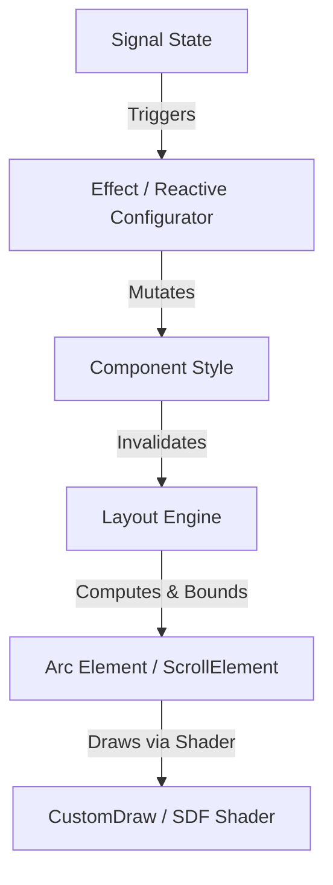

# MDT UI Framework - Developer User Guide

Welcome to the **MDT UI Framework**, a reactive, declarative, and state-free UI layout and rendering engine built on top of Arc framework for Mindustry.

This document describes the core architecture, reactive signal systems, styling paradigms, layout engine, and common component usages.

---

## 1. Core Architecture

The framework is split into three main layers:
1. **Signal Layer (`org.mindustrytool.libs.signal`)**: Handles reactive state tracking and propagation using a push-pull dependency-tracking model.
2. **Layout Layer (`org.mindustrytool.libs.ui.layout`)**: Computes absolute layout coordinates using a flexbox-like flow engine based on sizing policies and parent constraints.
3. **Component & Rendering Layer (`org.mindustrytool.libs.ui.components`/`core`)**: Wraps Arc `Element` nodes, provides fluent style builders, and draws high-performance rounded rectangles, borders, shadows, and gradients using an SDF shader.



---

## 2. Reactive Signal System

Reactivity is driven by three main concepts: `Signal`, `Computed`, and `Effect`. They capture dependencies automatically when accessed inside tracking contexts.

### Signals (`Signal<T>`)
Signals hold raw values. Reading them via `.get()` registers the active dependency, and updating them via `.set()` triggers all dependent reactions.
```java
Signal<Boolean> borderEnabled = new Signal<>(false);

// Update value
borderEnabled.set(true);

// Read value
boolean hasBorder = borderEnabled.get();
```

### Effects (`Effect`)
Effects track dependencies and re-run automatically when any signal they access changes. All styling and children lists in our UI system are wrapped in effects.
```java
// Create a reactive effect bound to the main thread dispatch
Effect.ofMain(() -> {
    System.out.println("Border Status: " + borderEnabled.get());
});
```

---

## 3. UI Component Hierarchy

All UI components implement the `Component` interface:
```java
public interface Component {
    Element element(); // Returns the raw Arc Element
    NodeSpec sizing(); // Returns the layout size specifications
    void dispose();     // Clean up resources and subscriptions
}
```

We provide three core primitives:

### 1. `CustomComponent`
A custom-rendered container representing the primary visual primitive of the framework. It renders solid backgrounds, multi-layered gradients, rounded borders, shadows, and backdrop filters using the SDF shader.
```java
CustomComponent.of()
    .style(s -> s
        .radius(12f)
        .background(Color.valueOf("1c1c22"))
        .border(2f, Color.white)
        .opacity(0.8f)
    );
```

### 2. `Text`
A reactive wrapper for text display. It automatically scales and supports dynamic text suppliers, word wrapping, and ellipsis truncation.
```java
Text.of()
    .style(s -> s
        .text("My Title")
        .size(1.4f)
        .labelAlign(Align.left)
    );
```

### 3. `Layout`
A Flexbox container that manages children layout flows. It is scrollable by default when configured via style constraints.
```java
Layout.of()
    .style(s -> s
        .column()
        .gap(8f)
        .padding(16f)
        .fixedWidth(260f)
    )
    .children(() -> Seq.with(
        Text.of().style(s -> s.text("Content")),
        CustomComponent.of().style(s -> s.fixedHeight(50f))
    ));
```

---

## 4. Unified Styling & Layout System

All styling is declarative and fluent. There are two primary style builder parent classes:

### `ComponentStyle`
Provides layout-agnostic properties matching `NodeSpec` and common Arc `Element` properties:
- **Sizing**: `width(float)`, `height(float)`, `fixedWidth(float)`, `fixedHeight(float)`, `minimumWidth(float)`, `maximumHeight(float)`, etc.
- **Sizing Modes**:
  - `SizeMode.WRAP`: Sized based on the preferred size of the content (default).
  - `SizeMode.GROW`: Expands to fill available space in the parent container.
  - `SizeMode.FIXED`: Constrained to a specific size.
- **Padding**: `padding(float)`, `padding(vertical, horizontal)`, `paddingTop(float)`, etc.
- **Interactive**: `visible(boolean)`, `touchable(Touchable)`, `name(String)`.

### `ContainerStyle` (Extends `ComponentStyle`)
Provides Flexbox container-specific formatting:
- **Direction**: `row()` (horizontal flow) or `column()` (vertical flow).
- **Spacers**: `gap(float)` defines margins between children.
- **Alignment**: 
  - `justifyContent(JustifyContent)` distributions along the main axis: `START`, `CENTER`, `END`, `SPACE_BETWEEN`, `SPACE_AROUND`, `SPACE_EVENLY`.
  - `alignItems(AlignItems)` alignment along the cross axis: `START`, `CENTER`, `END`, `STRETCH`.
- **Wrapping**: `wrap()` allows items to overflow to new lines, `noWrap()` keeps them inline.

---

## 5. Scroll Layout Configuration

You can enable and customize scrolling directly in a `Layout` container's style block:
```java
Layout.of()
    .style(s -> s
        .column()
        .fixedWidth(300f)
        .fixedHeight(200f)
        // Enable vertical scrolling, disable horizontal
        .scrollY(true)
        .scrollX(false)
        .fadeScrollBars(true)
        .smoothScrolling(true)
    );
```

---

## 6. Asynchronous Image Loading

The `CustomComponent` offers built-in caching and async image fetching:
```java
CustomComponent.of()
    .style(s -> s.radius(8f).fixedWidth(100f).fixedHeight(100f))
    .loadImage("https://example.com/image.png");
```
This performs a non-blocking background fetch and transitions smoothly once fully loaded.
