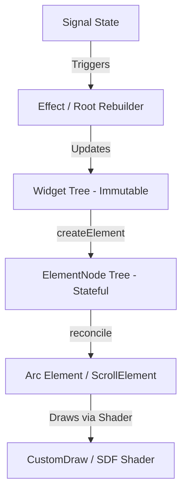

# MDT UI Framework - Developer User Guide

Welcome to the **MDT UI Framework**, a reactive, declarative, and immutable UI layout and rendering engine built on top of the Arc framework for Mindustry.

This document describes the core architecture, reactive signal systems, styling paradigms, layout engine, and common widget usages.

---

## 1. Core Architecture

The framework is split into three main layers:
1. **Signal Layer (`org.mindustrytool.libs.signal`)**: Handles reactive state tracking and propagation using a push-pull dependency-tracking model on the main thread.
2. **Widget Layer (`org.mindustrytool.libs.ui.widget` / `components`)**: Models a declarative, immutable UI hierarchy based on a 3-layer system similar to Flutter:
   - **Widget**: Immutable configurations defining UI nodes (using `final` fields).
   - **ElementNode**: Stateful backing nodes managing lifecycle (mount, update, dispose) and running the key-based reconciliation algorithm.
   - **Arc Element**: Physical UI nodes belonging to the native Arc UI scene graph (`arc.scene.Element`).



---

## 2. Reactive Signal System

Reactivity is driven by two main concepts: `Signal` and `Effect`. They capture dependencies automatically when accessed inside tracking contexts.

### Signals (`Signal<T>`)
Signals hold raw values. Reading them via `.get()` registers the active dependency, and updating them via `.set()` triggers all dependent reactions on the Main thread.
```java
Signal<Boolean> borderEnabled = new Signal<>(false);

// Update value
borderEnabled.set(true);

// Read value
boolean hasBorder = borderEnabled.get();
```

### Effects (`Effect`)
Effects track dependencies and re-run automatically when any signal they access changes.
In our widget architecture, a single root `Effect` is used to rebuild the widget tree based on the application state:
```java
Effect.of(() -> {
    AppState next = state.get();
    rootNode.update(build(next));
});
```

---

## 3. UI Component Hierarchy (Widget)

All UI widgets implement the `Widget` interface:
```java
public interface Widget {
    ElementNode createElement();
    
    default boolean canUpdate(Widget newWidget) {
        return getClass() == newWidget.getClass();
    }
    
    default Object key() {
        return null;
    }
}
```

We provide three core primitives and a base class for custom composition:

### 1. `CustomWidget`
A custom-rendered container representing the primary visual primitive of the framework. It renders solid backgrounds, multi-layered gradients, rounded borders, shadows, and glassmorphic backdrop filters using an SDF shader.
```java
CustomWidget.builder()
    .backgroundMode(CustomWidget.BackgroundMode.SOLID)
    .fillColor(Color.valueOf("1c1c22"))
    .topLeftRadius(12f).topRightRadius(12f)
    .bottomRightRadius(12f).bottomLeftRadius(12f)
    .borderWidth(2f).borderColor(Color.white)
    .opacity(0.8f)
    .build();
```

### 2. `TextWidget`
An immutable wrapper for text display. It automatically handles scaling, supports Mindustry's color markups, word wrapping, and ellipsis truncation.
```java
TextWidget.builder()
    .text("My Title")
    .fontScale(1.4f)
    .labelAlign(Align.left)
    .build();
```

### 3. `LayoutWidget`
A Flexbox container that manages children layout flows in rows or columns, with integrated scrolling (`scrollX`/`scrollY`).
```java
LayoutWidget.builder()
    .isColumn(true)
    .gap(8f)
    .paddingTop(16f).paddingBottom(16f)
    .widthMode(NodeSpec.SizeMode.FIXED).fixedWidth(260f)
    .children(Seq.with(
        TextWidget.builder().text("Content").build(),
        CustomWidget.builder().fixedHeight(50f).build()
    ))
    .build();
```

### 4. `StatelessWidget`
A base class allowing you to define custom composite components by composing existing core widgets without having to write custom `ElementNode` classes:
```java
public class MyCard extends StatelessWidget {
    private final String title;
    private final Widget child;

    public MyCard(String title, Widget child) {
        this.title = title;
        this.child = child;
    }

    @Override
    public Widget build() {
        return LayoutWidget.builder()
            .isColumn(true)
            .gap(8f)
            .background(CustomWidget.builder().fillColor(Color.darkGray).build())
            .children(Seq.with(
                TextWidget.builder().text(title).fontScale(1.2f).build(),
                child
            ))
            .build();
    }
}
```

---

## 4. Unified Styling & Layout System

Layout properties are modeled directly as widget fields matching `NodeSpec` configuration:
- **Sizing**: `fixedWidth`, `fixedHeight`, `minWidth`, `maxWidth`, `minHeight`, `maxHeight`.
- **Sizing Modes**:
  - `NodeSpec.SizeMode.WRAP`: Sized based on the preferred size of the content (default).
  - `NodeSpec.SizeMode.GROW`: Expands to fill available space in the parent container.
  - `NodeSpec.SizeMode.FIXED`: Constrained to a specific size.
- **Padding**: `paddingTop`, `paddingRight`, `paddingBottom`, `paddingLeft`.
- **Flex Layout properties**:
  - `justifyContent` (Main axis alignment): `START`, `CENTER`, `END`, `SPACE_BETWEEN`, `SPACE_AROUND`, `SPACE_EVENLY`.
  - `alignItems` (Cross axis alignment): `START`, `CENTER`, `END`, `STRETCH`.
  - `alignSelf` (Individual alignment override for child nodes).

---

## 5. Scroll Layout Configuration

You can enable and customize scrolling directly in a `LayoutWidget`:
```java
LayoutWidget.builder()
    .isColumn(true)
    .fixedWidth(300f)
    .fixedHeight(200f)
    .scrollY(true)
    .scrollX(false)
    .fadeScrollBars(true)
    .smoothScrolling(true)
    .build();
```

---

## 6. API Requests & Async State Management

Do not embed asynchronous network requests or loading states into widget render nodes. Instead, perform asynchronous work in the State layer using `Signal` and Retrofit/OkHttp:
```java
// In your State Manager
public void fetchImage() {
    api.getImageUrl().enqueue(new Callback<>() {
        @Override
        public void onResponse(Call<ImageUrl> call, Response<ImageUrl> response) {
            if (response.isSuccessful() && response.body() != null) {
                // Mutating the root Signal will automatically trigger reconciliation of the Widget tree
                state.set(state.get().withActiveUrl(response.body().url()));
            }
        }
        @Override
        public void onFailure(Call<ImageUrl> call, Throwable t) {
            log.error("API Fetch Failed", t);
        }
    });
}
```
