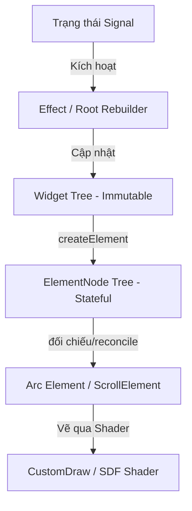

# MDT UI Framework - Hướng dẫn sử dụng cho nhà phát triển

Chào mừng bạn đến với **MDT UI Framework**, một bộ thư viện bố cục (layout) và hiển thị UI dạng reactive, khai báo (declarative) và bất biến (immutable), được xây dựng trên nền tảng framework Arc của Mindustry.

Tài liệu này mô tả kiến trúc cốt lõi, hệ thống tín hiệu phản xạ (reactive signal), mô hình thiết kế giao diện, công cụ dựng layout và cách sử dụng các widget phổ biến.

---

## 1. Kiến trúc cốt lõi

Framework được chia thành ba lớp chính:
1. **Lớp Tín hiệu (Signal Layer - `org.mindustrytool.libs.signal`)**: Quản lý trạng thái reactive và lan truyền thay đổi bằng mô hình kéo-đẩy tự động bắt phụ thuộc (push-pull dependency-tracking).
2. **Lớp Widget & Đối chiếu (Widget Layer - `org.mindustrytool.libs.ui.widget` / `components`)**: Mô hình hóa giao diện khai báo bất biến dựa trên cấu trúc cây 3 lớp tương tự Flutter:
   - **Widget**: Cấu hình bất biến của các thành phần giao diện (định nghĩa các trường `final`).
   - **ElementNode**: Nút đại diện có trạng thái (stateful) quản lý vòng đời (mount, update, dispose) và thực hiện thuật toán đối chiếu khóa (key-based reconciliation).
   - **Arc Element**: Các nút hiển thị vật lý thuộc cây phân cảnh gốc của Arc UI (`arc.scene.Element`).



---

## 2. Hệ thống Tín hiệu Phản xạ (Reactive Signal)

Tính phản xạ (reactivity) được vận hành bởi hai khái niệm chính: `Signal` và `Effect`. Chúng tự động phát hiện và đăng ký các dependency khi được truy cập bên trong ngữ cảnh tracking.

### Signals (`Signal<T>`)
Signals chứa các giá trị thô. Đọc giá trị qua `.get()` sẽ đăng ký dependency hiện tại, và cập nhật giá trị qua `.set()` sẽ kích hoạt tất cả các phản xạ (reactions) phụ thuộc trên Main thread.
```java
Signal<Boolean> borderEnabled = new Signal<>(false);

// Cập nhật giá trị
borderEnabled.set(true);

// Đọc giá trị
boolean hasBorder = borderEnabled.get();
```

### Effects (`Effect`)
Effects tự động theo dõi các dependency và chạy lại khi bất kỳ signal nào chúng truy cập thay đổi. 
Trong hệ thống mới, chúng ta sử dụng một `Effect` duy nhất ở cấp root để cập nhật toàn bộ cây widget từ tín hiệu trạng thái gốc (`AppState`):
```java
Effect.of(() -> {
    AppState next = state.get();
    rootNode.update(build(next));
});
```

---

## 3. Hệ thống Component UI (Widget)

Tất cả các widget giao diện đều implement interface `Widget`:
```java
public interface Widget {
    ElementNode createElement();
    
    default boolean canUpdate(Widget newWidget) {
        return getClass() == newWidget.getClass();
    }
    
    default Object key() {
        return null;
    }
}
```

Chúng ta cung cấp ba widget cốt lõi và một lớp cơ sở để tạo widget tự định nghĩa:

### 1. `CustomWidget`
Một container tùy biến hiển thị, cung cấp nền màu đơn sắc, gradient nhiều lớp, viền bo góc, bóng đổ và các hiệu ứng bộ lọc kính mờ (backdrop filter) bằng SDF shader.
```java
CustomWidget.builder()
    .backgroundMode(CustomWidget.BackgroundMode.SOLID)
    .fillColor(Color.valueOf("1c1c22"))
    .topLeftRadius(12f).topRightRadius(12f)
    .bottomRightRadius(12f).bottomLeftRadius(12f)
    .borderWidth(2f).borderColor(Color.white)
    .opacity(0.8f)
    .build();
```

### 2. `TextWidget`
Widget hiển thị văn bản bất biến. Tự động xuống dòng tự động, hỗ trợ các định dạng markup màu sắc của Mindustry, tỷ lệ cỡ chữ và rút gọn văn bản bằng dấu ba chấm (ellipsis).
```java
TextWidget.builder()
    .text("Tiêu đề của tôi")
    .fontScale(1.4f)
    .labelAlign(Align.left)
    .build();
```

### 3. `LayoutWidget`
Container dạng Flexbox quản lý luồng hiển thị của các phần tử con theo hàng (`row`) hoặc cột (`column`), hỗ trợ cuộn (`scrollX`/`scrollY`) tích hợp.
```java
LayoutWidget.builder()
    .isColumn(true)
    .gap(8f)
    .paddingTop(16f).paddingBottom(16f)
    .widthMode(NodeSpec.SizeMode.FIXED).fixedWidth(260f)
    .children(Seq.with(
        TextWidget.builder().text("Nội dung").build(),
        CustomWidget.builder().fixedHeight(50f).build()
    ))
    .build();
```

### 4. `StatelessWidget`
Lớp cơ sở cho phép bạn định nghĩa các widget tự do bằng phương pháp tổng hợp (composition) từ các widget cốt lõi mà không cần tạo `ElementNode` thủ công:
```java
public class MyCard extends StatelessWidget {
    private final String title;
    private final Widget child;

    public MyCard(String title, Widget child) {
        this.title = title;
        this.child = child;
    }

    @Override
    public Widget build() {
        return LayoutWidget.builder()
            .isColumn(true)
            .gap(8f)
            .background(CustomWidget.builder().fillColor(Color.darkGray).build())
            .children(Seq.with(
                TextWidget.builder().text(title).fontScale(1.2f).build(),
                child
            ))
            .build();
    }
}
```

---

## 4. Hệ thống Thiết kế & Bố cục Đồng nhất

Mọi thuộc tính bố cục được mô hình hóa trực tiếp trong widget thông qua `NodeSpec` cấu hình:
- **Kích thước**: `fixedWidth`, `fixedHeight`, `minWidth`, `maxWidth`, `minHeight`, `maxHeight`.
- **Chế độ kích thước (Sizing Modes)**:
  - `NodeSpec.SizeMode.WRAP`: Kích thước dựa trên phần tử con (mặc định).
  - `NodeSpec.SizeMode.GROW`: Giãn ra để lấp đầy không gian còn lại trong container cha.
  - `NodeSpec.SizeMode.FIXED`: Cố định kích thước theo tọa độ cụ thể.
- **Padding**: `paddingTop`, `paddingRight`, `paddingBottom`, `paddingLeft`.
- **Căn lề (Flex properties)**:
  - `justifyContent` (Main axis): `START`, `CENTER`, `END`, `SPACE_BETWEEN`, `SPACE_AROUND`, `SPACE_EVENLY`.
  - `alignItems` (Cross axis): `START`, `CENTER`, `END`, `STRETCH`.
  - `alignSelf` (Lựa chọn căn lề riêng biệt của phần tử con).

---

## 5. Cấu hình cuộn (Scroll Layout)

Bạn có thể bật và tùy chỉnh thanh cuộn trực tiếp trong `LayoutWidget`:
```java
LayoutWidget.builder()
    .isColumn(true)
    .fixedWidth(300f)
    .fixedHeight(200f)
    .scrollY(true)
    .scrollX(false)
    .fadeScrollBars(true)
    .smoothScrolling(true)
    .build();
```

---

## 6. Gọi API & Xử lý Trạng thái Bất đồng bộ

Thay vì nhúng các logic bất đồng bộ vào component, hãy xử lý ở tầng trạng thái (State Layer) thông qua `Signal` và Retrofit/OkHttp:
```java
// Trong State Manager của bạn
public void fetchImage() {
    api.getImageUrl().enqueue(new Callback<>() {
        @Override
        public void onResponse(Call<ImageUrl> call, Response<ImageUrl> response) {
            if (response.isSuccessful() && response.body() != null) {
                // Việc cập nhật Signal sẽ tự động kích hoạt quá trình đối chiếu cây Widget
                state.set(state.get().withActiveUrl(response.body().url()));
            }
        }
        @Override
        public void onFailure(Call<ImageUrl> call, Throwable t) {
            log.error("Lỗi tải dữ liệu", t);
        }
    });
}
```
