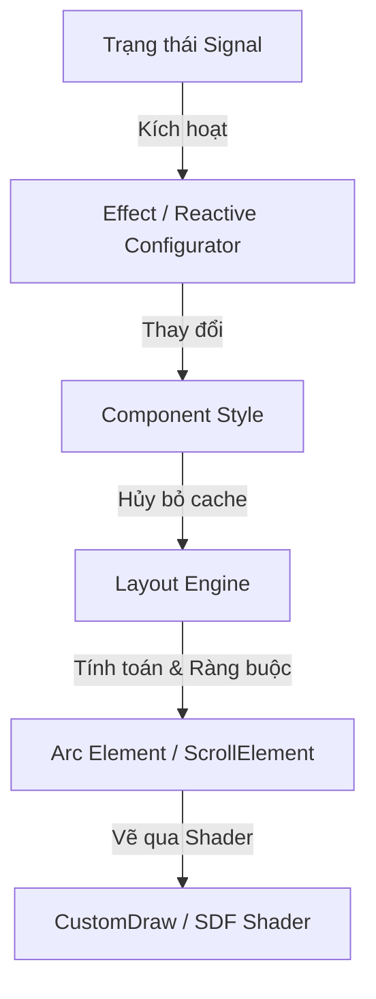

# MDT UI Framework - Hướng dẫn sử dụng cho nhà phát triển

Chào mừng bạn đến với **MDT UI Framework**, một bộ thư viện bố cục (layout) và hiển thị UI dạng reactive, khai báo (declarative) và không lưu trạng thái (state-free), được xây dựng trên nền tảng framework Arc của Mindustry.

Tài liệu này mô tả kiến trúc cốt lõi, hệ thống tín hiệu phản xạ (reactive signal), mô hình thiết kế giao diện, công cụ dựng layout và cách sử dụng các component phổ biến.

---

## 1. Kiến trúc cốt lõi

Framework được chia thành ba lớp chính:
1. **Lớp Tín hiệu (Signal Layer - `org.mindustrytool.libs.signal`)**: Quản lý trạng thái reactive và lan truyền thay đổi bằng mô hình kéo-đẩy tự động bắt phụ thuộc (push-pull dependency-tracking).
2. **Lớp Bố cục (Layout Layer - `org.mindustrytool.libs.ui.layout`)**: Tính toán tọa độ hiển thị tuyệt đối bằng công cụ luồng tương tự như CSS Flexbox dựa trên các chính sách kích thước và ràng buộc của cha.
3. **Lớp Component & Hiển thị (`org.mindustrytool.libs.ui.components`/`core`)**: Bọc các node `Element` của Arc, cung cấp các builder thiết kế giao diện fluent, và vẽ các hình hộp bo góc, viền, bóng, màu gradient hiệu năng cao bằng SDF shader.



---

## 2. Hệ thống Tín hiệu Phản xạ (Reactive Signal)

Tính phản xạ (reactivity) được vận hành bởi ba khái niệm chính: `Signal`, `Computed`, và `Effect`. Chúng tự động phát hiện và đăng ký các dependency khi được truy cập bên trong ngữ cảnh tracking.

### Signals (`Signal<T>`)
Signals chứa các giá trị thô. Đọc giá trị qua `.get()` sẽ đăng ký dependency hiện tại, và cập nhật giá trị qua `.set()` sẽ kích hoạt tất cả các phản xạ (reactions) phụ thuộc.
```java
Signal<Boolean> borderEnabled = new Signal<>(false);

// Cập nhật giá trị
borderEnabled.set(true);

// Đọc giá trị
boolean hasBorder = borderEnabled.get();
```

### Effects (`Effect`)
Effects tự động theo dõi các dependency và chạy lại khi bất kỳ signal nào chúng truy cập thay đổi. Tất cả cấu hình style và danh sách con (children) trong hệ thống UI của chúng ta đều được bọc trong các effects.
```java
// Tạo một reactive effect chạy trên Main thread dispatch
Effect.ofMain(() -> {
    System.out.println("Trạng thái viền: " + borderEnabled.get());
});
```

---

## 3. Hệ thống Component UI

Tất cả các UI component đều implement interface `Component`:
```java
public interface Component {
    Element element(); // Trả về đối tượng Arc Element gốc
    NodeSpec sizing(); // Trả về thông số kích thước layout
    void dispose();     // Giải phóng tài nguyên và dọn dẹp subscription
}
```

Chúng ta cung cấp ba component cốt lõi:

### 1. `CustomComponent`
Một container tùy biến hiển thị, là phần tử trực quan chính của framework. Renders nền màu đơn sắc, gradient nhiều lớp, viền bo góc, bóng đổ và các hiệu ứng bộ lọc kính mờ (backdrop filter) bằng SDF shader.
```java
CustomComponent.of()
    .style(s -> s
        .radius(12f)
        .background(Color.valueOf("1c1c22"))
        .border(2f, Color.white)
        .opacity(0.8f)
    );
```

### 2. `Text`
Component hiển thị văn bản reactive. Nó tự động co giãn và hỗ trợ các nhà cung cấp chuỗi động (dynamic text suppliers), xuống dòng tự động, và rút gọn văn bản bằng dấu ba chấm (ellipsis).
```java
Text.of()
    .style(s -> s
        .text("Tiêu đề của tôi")
        .size(1.4f)
        .labelAlign(Align.left)
    );
```

### 3. `Layout`
Container dạng Flexbox quản lý luồng hiển thị của các phần tử con. Nó hỗ trợ thanh cuộn (scrolling) tích hợp khi cấu hình qua style.
```java
Layout.of()
    .style(s -> s
        .column()
        .gap(8f)
        .padding(16f)
        .fixedWidth(260f)
    )
    .children(() -> Seq.with(
        Text.of().style(s -> s.text("Nội dung")),
        CustomComponent.of().style(s -> s.fixedHeight(50f))
    ));
```

---

## 4. Hệ thống Thiết kế & Bố cục Đồng nhất

Tất cả các cấu hình style đều mang phong cách khai báo (declarative) và hỗ trợ nối chuỗi fluent. Có hai lớp cha chính cho các style builder:

### `ComponentStyle`
Cung cấp các thuộc tính không phụ thuộc vào loại bố cục, tương ứng với `NodeSpec` và các thuộc tính Arc `Element` chung:
- **Kích thước**: `width(float)`, `height(float)`, `fixedWidth(float)`, `fixedHeight(float)`, `minimumWidth(float)`, `maximumHeight(float)`, v.v.
- **Chế độ kích thước (Sizing Modes)**:
  - `SizeMode.WRAP`: Kích thước dựa trên phần tử con (mặc định).
  - `SizeMode.GROW`: Giãn ra để lấp đầy không gian còn lại trong container cha.
  - `SizeMode.FIXED`: Cố định kích thước theo tọa độ cụ thể.
- **Padding**: `padding(float)`, `padding(vertical, horizontal)`, `paddingTop(float)`, v.v.
- **Tương tác**: `visible(boolean)`, `touchable(Touchable)`, `name(String)`.

### `ContainerStyle` (Kế thừa từ `ComponentStyle`)
Cung cấp các thuộc tính riêng cho container Flexbox:
- **Hướng**: `row()` (nằm ngang) hoặc `column()` (nằm dọc).
- **Khoảng cách**: `gap(float)` định nghĩa khoảng cách lề giữa các phần tử con.
- **Căn lề**: 
  - `justifyContent(JustifyContent)` phân bổ dọc theo trục chính: `START`, `CENTER`, `END`, `SPACE_BETWEEN`, `SPACE_AROUND`, `SPACE_EVENLY`.
  - `alignItems(AlignItems)` căn chỉnh dọc theo trục phụ: `START`, `CENTER`, `END`, `STRETCH`.
- **Xuống dòng**: `wrap()` cho phép các phần tử tự động xuống dòng mới khi vượt quá giới hạn, `noWrap()` giữ chúng trên một hàng.

---

## 5. Cấu hình cuộn (Scroll Layout)

Bạn có thể bật và tùy chỉnh thanh cuộn trực tiếp trong khối style của `Layout`:
```java
Layout.of()
    .style(s -> s
        .column()
        .fixedWidth(300f)
        .fixedHeight(200f)
        // Bật cuộn dọc, tắt cuộn ngang
        .scrollY(true)
        .scrollX(false)
        .fadeScrollBars(true)
        .smoothScrolling(true)
    );
```

---

## 6. Tải ảnh bất đồng bộ

`CustomComponent` hỗ trợ cơ chế cache và tải ảnh bất đồng bộ từ URL:
```java
CustomComponent.of()
    .style(s -> s.radius(8f).fixedWidth(100f).fixedHeight(100f))
    .loadImage("https://example.com/image.png");
```
Quá trình này tải ảnh ngầm không gây đứng game, và tự động chuyển cảnh mượt mà khi ảnh tải xong.
